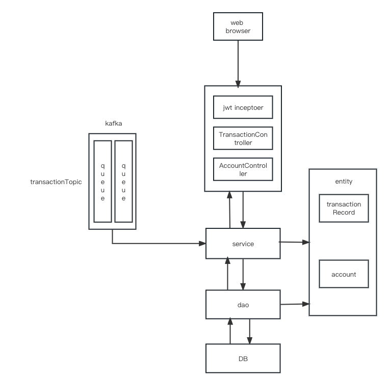
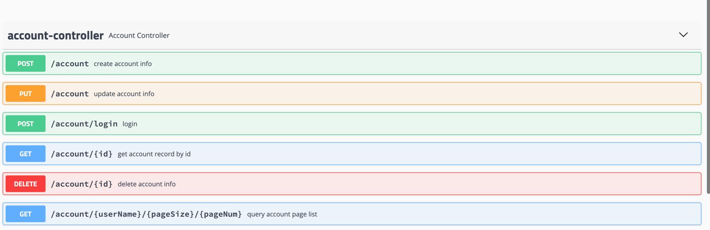
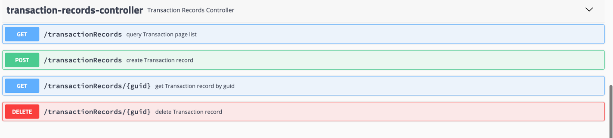
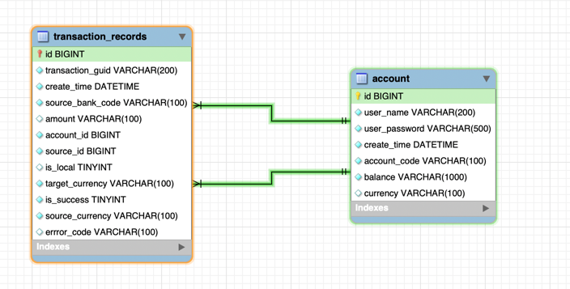
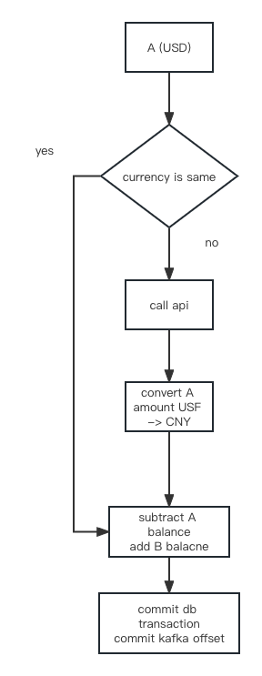

# bankPortal Readme

### environment
- mac os
- java version 1.8.0_361 
- spring boot 2.3.12.RELEASE
- mysql 5.1.49
- kafka 2.5.0 
- docker 23.0.2
- kubernetes v1.26.3
- minikube v1.30.1 
- maven 3.6.0
- homebrew

### Demo
https://drive.google.com/file/d/15u5o98qgIJxPYXUnXvstWBLo6xOvY9Mz/view?usp=sharing

### build source code
- cd to source directory. 
````shell
   mvn package -DskipTests=true
````

#### build bank images
copy the jar files(deployment.yaml,portal-0.0.1-SNAPSHOT.jar,Dockerfile) in the same folder
````shell
docker build -t bank:2.0 .
minikube image load bank:2.0
kubectl apply -f deployeny.yaml
docker image
````


## deploy bankPortal service
1. start the minikube
````shell
minikube start
minikube dashboard
````
2. load the local image to minikube
````shell
minikube image load bank:latest .
registry.k8s.io/pause:3.9
registry.k8s.io/kube-scheduler:v1.26.3
registry.k8s.io/kube-proxy:v1.26.3
registry.k8s.io/kube-controller-manager:v1.26.3
registry.k8s.io/kube-apiserver:v1.26.3
registry.k8s.io/etcd:3.5.6-0
registry.k8s.io/coredns/coredns:v1.9.3
gcr.io/k8s-minikube/storage-provisioner:v5
docker.io/library/nginx:1.7.9
docker.io/library/java:openjdk-8u111-jdk-alpine
#---our image
docker.io/library/bank:latest
#---
docker.io/kubernetesui/metrics-scraper
docker.io/kubernetesui/dashboard
````

3. create pod and service in k8s.there are three ways to start bank service
- resource description file
````shell
kubectl apply -f deployment.yaml
#output success
service/bank created
deployment.apps/bank created
````
- or you can use minikube cmd
- once minikube started, you can interact with your cluster using kubectl, just like any other Kubernetes cluster. For instance, starting a server:
````shell
kubectl create deployment bank --image=bank:latest
kubectl expose deployment bank --type=NodePort --port=8090
````
- minikube makes it easy to open this exposed endpoint in your browser:
````shell
minikube service bank
````

#### finally
- forward the k8s port to host port
````shell
kubectl port-forward deployment/bank 8090:8090
````
- browse http://127.0.0.1:8090/swagger-ui.html#/


## Code

- code organized
> Classic MVC architecture .MVC （Model,View,Controller） .Don't have View in this project  
> Architecture


- controller restful api
- controller restful api
about account

about transaction


- Data model  
there are two model.
  
- table source sql  
transaction_recrod
````sql
create table bank_portal.transaction_records
(
    id               bigint auto_increment
        primary key,
    transaction_guid varchar(200)      not null comment 'trancation unique id',
    create_time      datetime          not null,
    source_bank_code varchar(100)      not null comment 'source bank code',
    amount           varchar(100)      null comment 'transaction amount
',
    account_id       bigint            not null comment 'target account id',
    source_id        bigint            not null comment 'source account id',
    is_local         tinyint default 0 null comment 'is local bank 
',
    target_currency  varchar(100)      not null,
    is_success       tinyint           not null,
    source_currency  varchar(100)      not null,
    error_code      varchar(100)      null,
    constraint trancation_guid
        unique (transaction_guid)
);


````
account
````sql
create table bank_portal.account
(
    id            bigint auto_increment
        primary key,
    user_name     varchar(200)  not null comment 'user name',
    user_password varchar(500)  not null comment 'user password',
    create_time   datetime      not null comment 'created time',
    account_code  varchar(100)  not null comment 'unique code',
    balance       varchar(1000) not null comment 'balance',
    currency      varchar(100)  null,
    constraint account_code
        unique (account_code)
);
bin/zookeeper-server-start.sh config/zookeeper.properties
Open another terminal session and run:

# Start the Kafka broker service
$ bin/kafka-server-start.sh config/server.properties

````

- requirements
> example one
>
> Account A the currency is USD  
> Account B the currency is CNY
> when A transfer 120 to B. they have different currency .
> call API get convert rate.（7.1）. convert amount 120 (USD) to 16.9 (CNY)
> subtract 16.9 from A and add B 120
> second update the database in a transaction
> finally commit offset to kafka

> example two
> Account A the currency is USD  
> Account B the currency is CNY
> when A transfer 120 to B. they have save currency .
> subtract 120 from A and add B 120
> second update the database in a transaction
> finally commit offset to kafka


